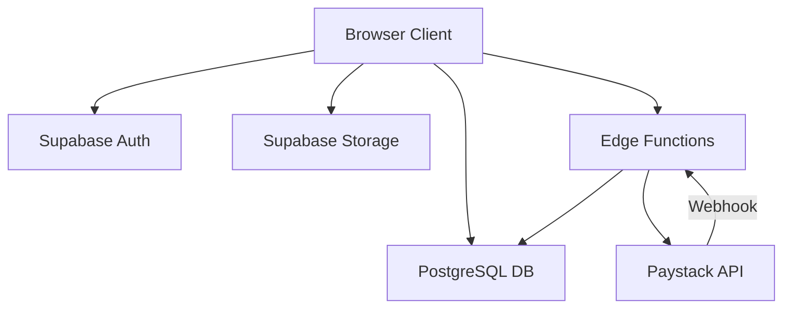

# Architecture

The platform follows a zero-dollar infrastructure target (for the pilot), utilizing a static/client-driven frontend and a serverless backend.

## Frontend
- **Framework**: Next.js (React) configured for static export where possible or lightweight SSR.
- **Styling**: Tailwind CSS
- **Hosting**: Target is Cloudflare Pages or Vercel Free Tier.
- **State**: Minimal local component state (React hooks), Supabase for server state.

## Backend & Database
- **Provider**: Supabase (Auth, PostgreSQL, Storage, Edge Functions).
- **Database**: PostgreSQL with Row-Level Security (RLS) enabled on all sensitive tables.
- **Business Logic**: Supabase Edge Functions and PostgreSQL RPCs for critical operations (e.g., campaign finalization, coin grants).

## Core Mechanisms
- **Coin Ledger**: Append-only transactional ledger for coin balances to prevent race conditions.
- **Campaign Engine**: The store is open for a fixed period. Carts are converted into orders transactionally when the countdown ends.
- **Payments**: Paystack integrated via Edge Functions. Verified by webhook.

## Data Flow Diagram

